# [📈 Live Status](https://tsolenthaler.github.io/DashboardWebsitesTSO): <!--live status--> **🟧 Partial outage**

This repository contains the open-source uptime monitor and status page for [Thomas Solenthaler](https://tsolenthaler.github.io/DashboardWebsitesTSO), powered by [Upptime](https://github.com/upptime/upptime).

With [Upptime](https://upptime.js.org), you can get your own unlimited and free uptime monitor and status page, powered entirely by a GitHub repository. We use [Issues](https://github.com/tsolenthaler/DashboardWebsitesTSO/issues) as incident reports, [Actions](https://github.com/tsolenthaler/DashboardWebsitesTSO/actions) as uptime monitors, and [Pages](https://tsolenthaler.github.io/DashboardWebsitesTSO) for the status page.

<!--start: status pages-->
<!-- This summary is generated by Upptime (https://github.com/upptime/upptime) -->
<!-- Do not edit this manually, your changes will be overwritten -->
<!-- prettier-ignore -->
| URL | Status | History | Response Time | Uptime |
| --- | ------ | ------- | ------------- | ------ |
|  [Appenzeller Bahnen](https://appenzellerbahnen.ch) | 🟥 Down | [appenzeller-bahnen.yml](https://github.com/tsolenthaler/DashboardWebsitesTSO/commits/HEAD/history/appenzeller-bahnen.yml) | 

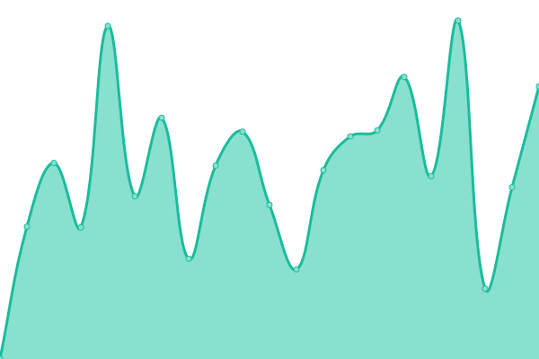 954ms
     
 | 

<a href="https://tsolenthaler.github.io/DashboardWebsitesTSO/history/appenzeller-bahnen">89.31%</a>
    

|  [St. Gallen Bodensee](https://st.gallen-bodensee.ch) | 🟥 Down | [st-gallen-bodensee.yml](https://github.com/tsolenthaler/DashboardWebsitesTSO/commits/HEAD/history/st-gallen-bodensee.yml) | 

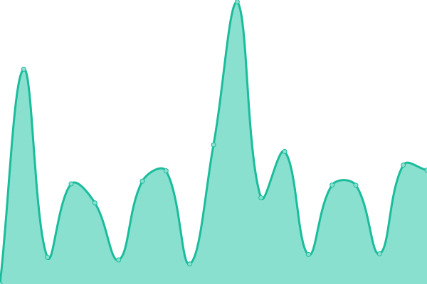 1083ms
     
 | 

<a href="https://tsolenthaler.github.io/DashboardWebsitesTSO/history/st-gallen-bodensee">89.33%</a>
    

|  [Glarnerland](https://glarnerland.ch) | 🟥 Down | [glarnerland.yml](https://github.com/tsolenthaler/DashboardWebsitesTSO/commits/HEAD/history/glarnerland.yml) | 

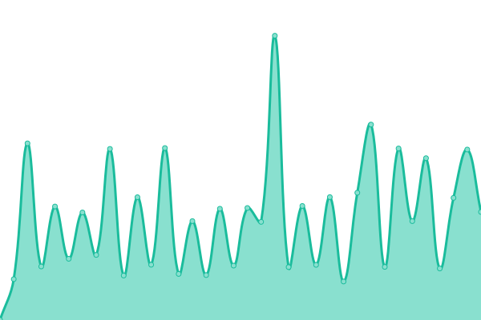 898ms
     
 | 

<a href="https://tsolenthaler.github.io/DashboardWebsitesTSO/history/glarnerland">89.82%</a>
    

|  [Thurgau Bodensee](https://thurgau-bodensee.ch) | 🟥 Down | [thurgau-bodensee.yml](https://github.com/tsolenthaler/DashboardWebsitesTSO/commits/HEAD/history/thurgau-bodensee.yml) | 

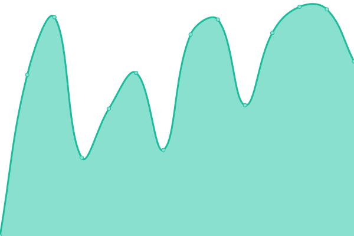 1033ms
     
 | 

<a href="https://tsolenthaler.github.io/DashboardWebsitesTSO/history/thurgau-bodensee">89.33%</a>
    

|  [Heidiland](https://heidiland.com) | 🟥 Down | [heidiland.yml](https://github.com/tsolenthaler/DashboardWebsitesTSO/commits/HEAD/history/heidiland.yml) | 

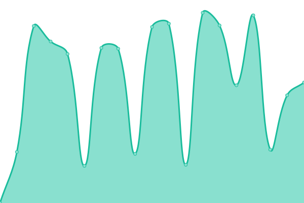 1026ms
     
 | 

<a href="https://tsolenthaler.github.io/DashboardWebsitesTSO/history/heidiland">89.34%</a>
    

|  [Liechtenstein Tourismus](https://tourismus.li) | 🟥 Down | [liechtenstein-tourismus.yml](https://github.com/tsolenthaler/DashboardWebsitesTSO/commits/HEAD/history/liechtenstein-tourismus.yml) | 

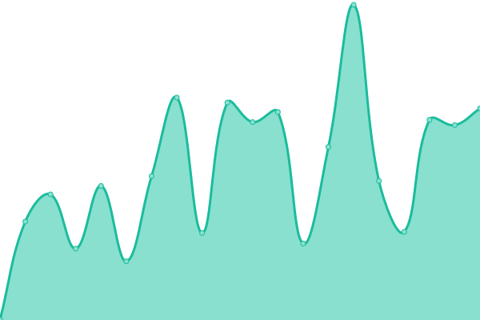 812ms
     
 | 

<a href="https://tsolenthaler.github.io/DashboardWebsitesTSO/history/liechtenstein-tourismus">89.83%</a>
    

|  [Jungfrauregion](https://jungfrauregion.swiss) | 🟥 Down | [jungfrauregion.yml](https://github.com/tsolenthaler/DashboardWebsitesTSO/commits/HEAD/history/jungfrauregion.yml) | 

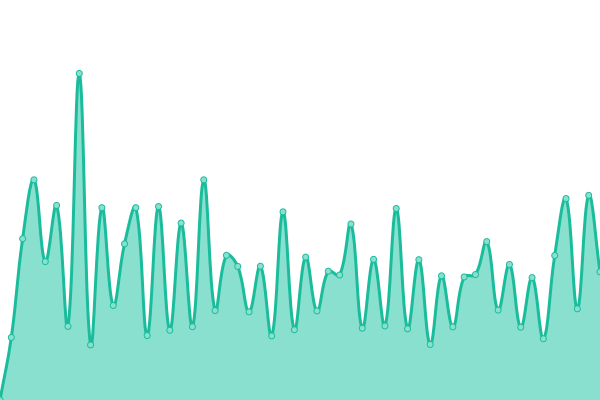 768ms
     
 | 

<a href="https://tsolenthaler.github.io/DashboardWebsitesTSO/history/jungfrauregion">89.35%</a>
    

|  [Viamala](https://viamala.ch/) | 🟥 Down | [viamala.yml](https://github.com/tsolenthaler/DashboardWebsitesTSO/commits/HEAD/history/viamala.yml) | 

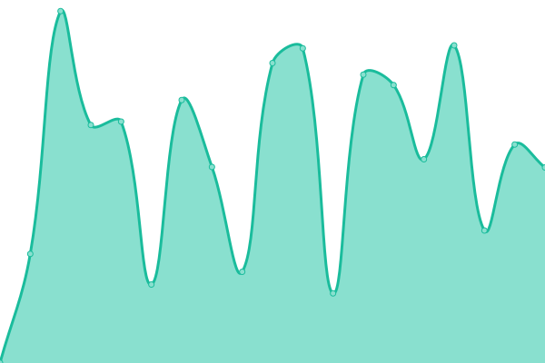 815ms
     
 | 

<a href="https://tsolenthaler.github.io/DashboardWebsitesTSO/history/viamala">89.37%</a>
    

|  [Appenzellerland](https://appenzellerland.ch) | 🟥 Down | [appenzellerland.yml](https://github.com/tsolenthaler/DashboardWebsitesTSO/commits/HEAD/history/appenzellerland.yml) | 

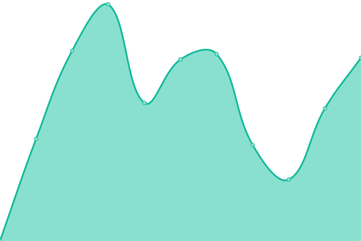 1026ms
     
 | 

<a href="https://tsolenthaler.github.io/DashboardWebsitesTSO/history/appenzellerland">89.38%</a>
    

|  [Toggenburg](https://toggenburg.swiss) | 🟥 Down | [toggenburg.yml](https://github.com/tsolenthaler/DashboardWebsitesTSO/commits/HEAD/history/toggenburg.yml) | 

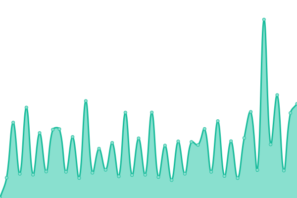 1007ms
     
 | 

<a href="https://tsolenthaler.github.io/DashboardWebsitesTSO/history/toggenburg">89.39%</a>
    

|  [Winterthur](https://winterthur.com) | 🟥 Down | [winterthur.yml](https://github.com/tsolenthaler/DashboardWebsitesTSO/commits/HEAD/history/winterthur.yml) | 

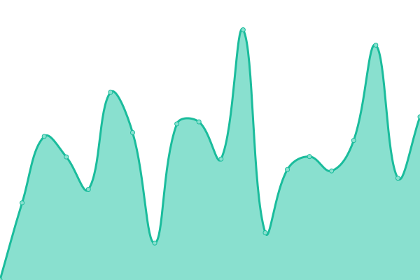 983ms
     
 | 

<a href="https://tsolenthaler.github.io/DashboardWebsitesTSO/history/winterthur">89.40%</a>
    

|  [Herzroute](https://herzroute.ch) | 🟥 Down | [herzroute.yml](https://github.com/tsolenthaler/DashboardWebsitesTSO/commits/HEAD/history/herzroute.yml) | 

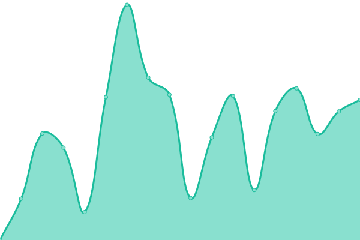 1044ms
     
 | 

<a href="https://tsolenthaler.github.io/DashboardWebsitesTSO/history/herzroute">89.17%</a>
    

|  [Ostschweiz](https://ostschweiz.ch) | 🟥 Down | [ostschweiz.yml](https://github.com/tsolenthaler/DashboardWebsitesTSO/commits/HEAD/history/ostschweiz.yml) | 

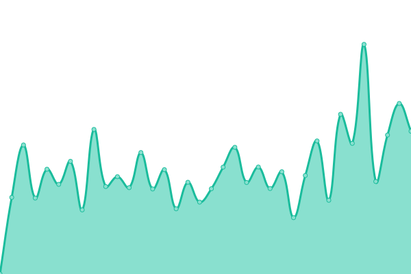 952ms
     
 | 

<a href="https://tsolenthaler.github.io/DashboardWebsitesTSO/history/ostschweiz">89.58%</a>
    

|  [Ogfs](https://ogfs.ch) | 🟥 Down | [ogfs.yml](https://github.com/tsolenthaler/DashboardWebsitesTSO/commits/HEAD/history/ogfs.yml) | 

 1399ms
     
 | 

<a href="https://tsolenthaler.github.io/DashboardWebsitesTSO/history/ogfs">89.58%</a>
    

|  [Aargau Tourismus](https://aargautourismus.ch) | 🟩 Up | [aargau-tourismus.yml](https://github.com/tsolenthaler/DashboardWebsitesTSO/commits/HEAD/history/aargau-tourismus.yml) | 

 1075ms
     
 | 

<a href="https://tsolenthaler.github.io/DashboardWebsitesTSO/history/aargau-tourismus">98.80%</a>
    

<!--end: status pages-->

[**Visit our status website →**](https://tsolenthaler.github.io/DashboardWebsitesTSO)

## 📄 License

- Powered by: [Upptime](https://github.com/upptime/upptime)
- Code: [MIT](./LICENSE) © [Anand Chowdhary](https://anandchowdhary.com), supported by [Pabio](https://pabio.com)
- Data in the `./history` directory: [Open Database License](https://opendatacommons.org/licenses/odbl/1-0/)
